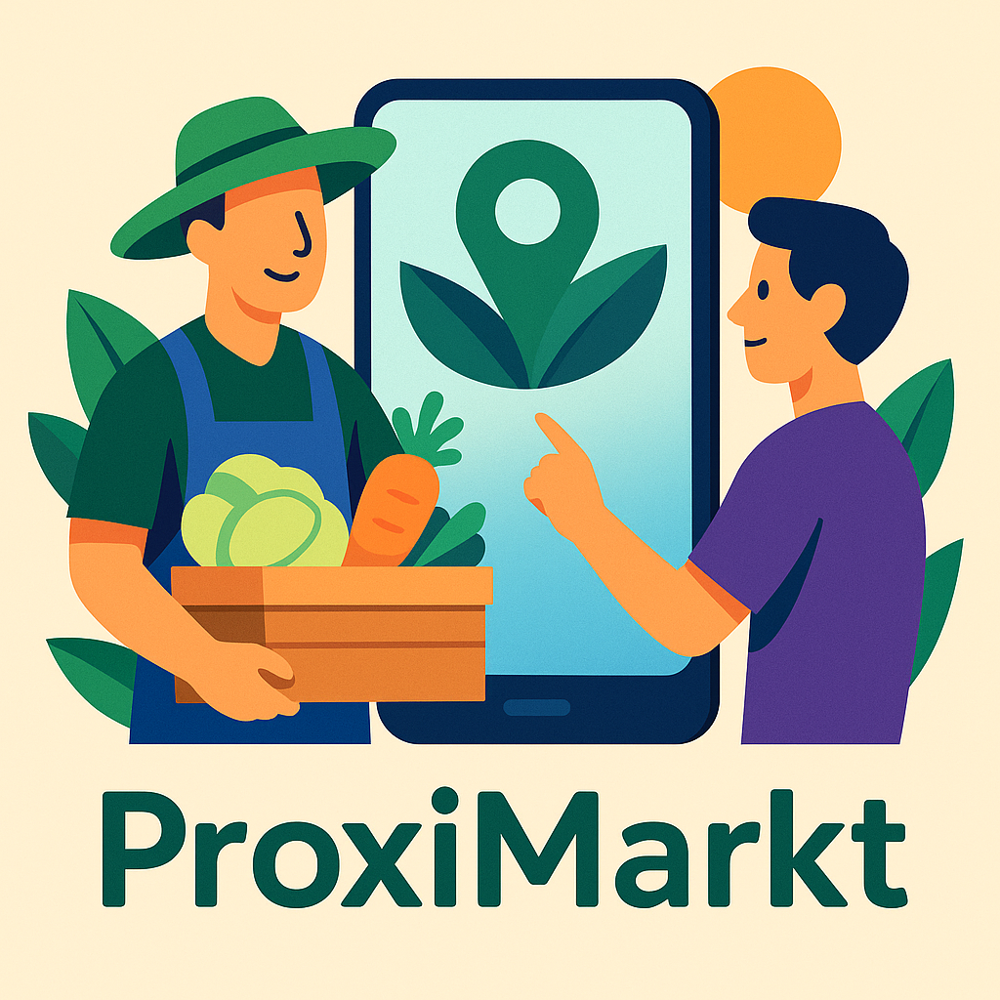

# Projecte ProxiMarkt. Mercat de proximitat.

El projecte ProiMarkt planteja el desenvolupament d'una plataforma/aplicació que permeta posar en contacte productors i comerços locals amb els seus clients, afavorint així el comerç de proximitat.

El projecte comprén diversos mòduls del CFGS en Desenvolupament d'Aplicacions Multiplataforma, però podria adaptar-se bé al CFGS en Desenvolupament d'Aplicacions Web.

